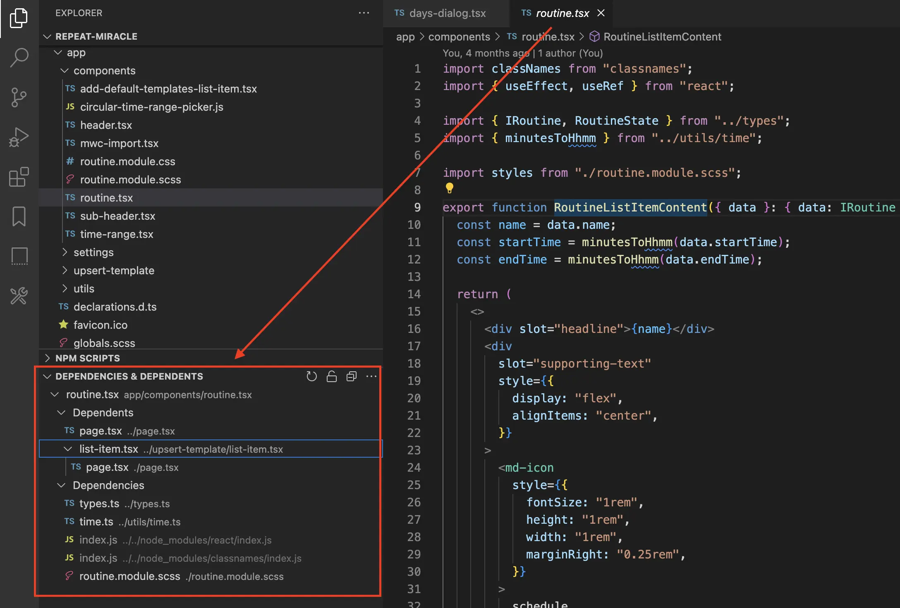
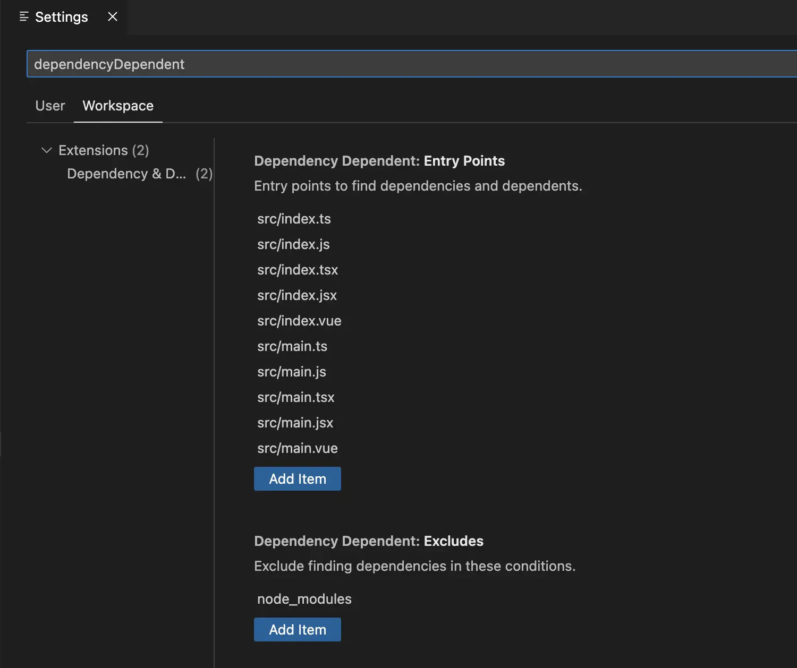

# Dependency & Dependent

English | [简体中文](./README.zh-CN.md)

Show dependencies and dependents.



## Settings



### Entry Points

`dependencyDependent.entryPoints` config entry points to find dependencies and dependents. Default:

```json
[
  "src/index.ts",
  "src/index.js",
  "src/index.tsx",
  "src/index.jsx",
  "src/index.vue",
  "src/main.ts",
  "src/main.js",
  "src/main.tsx",
  "src/main.jsx",
  "src/main.vue"
]
```

If the entry points of your project is not in the default setting, you can add them.

### Excludes

`dependencyDependent.excludes` config finding dependencies in these conditions. Default:

```json
["node_modules"]
```

If you need to excludes other files, you can add them. If you want to find the dependencies and dependents of `node_modules`, you can delete the `node_modules` in the `dependencyDependent.excludes`.

## Install via CLI

```bash
code --install-extension zjffun.dependency-dependent
```

## [Release Notes](./CHANGELOG.md)

## [Contribute](./CONTRIBUTING.md)
