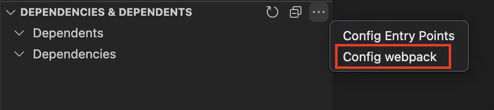

# 依赖和使用者

[English](./README.md) | 简体中文

**注意 1：有些依赖可能使用特殊的配置引入（例如：[webpack alias](https://webpack.js.org/configuration/resolve/#resolvealias)），这些依赖默认无法收集到，可以通过[配置 webpack](#配置-webpack)收集他们。**

**注意 2：本拓展程序不会自动更新依赖数据，需要手动点击刷新按钮更新依赖数据。**

查看依赖和使用者。


## 配置


### 入口文件

`dependencyDependent.entryPoints` 配置从哪些文件开始寻找依赖。默认是：

```json
[
  "src/index.ts",
  "src/index.js",
  "src/index.tsx",
  "src/index.jsx",
  "src/index.vue",
  "src/main.ts",
  "src/main.js",
  "src/main.tsx",
  "src/main.jsx",
  "src/main.vue"
]
```

如果你的项目的入口文件不在默认配置中，可以自行添加。

### 忽略文件

`dependencyDependent.excludes` 配置忽略寻找依赖的条件，默认是：

```json
["node_modules"]
```

如果需要忽略其他文件，可以自行添加。如果希望寻找 `node_modules` 的依赖可以删掉 `node_modules` 这个条件。

## 配置 webpack

### 一、点击“配置 webpack”按钮



### 二、修改拓展使用的 webpack 配置

你可以在 `.vscode/dependency-dependent-webpack-config.js` 文件中修改任意 [webpack 配置](https://webpack.js.org/configuration/)。

## 通过命令行安装

```bash
code --install-extension zjffun.dependency-dependent
```

## [更新日志](./CHANGELOG.md)

## [贡献](./CONTRIBUTING.md)
