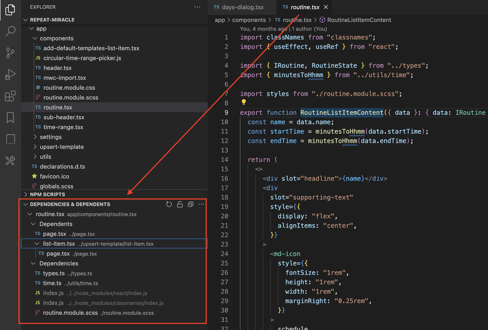
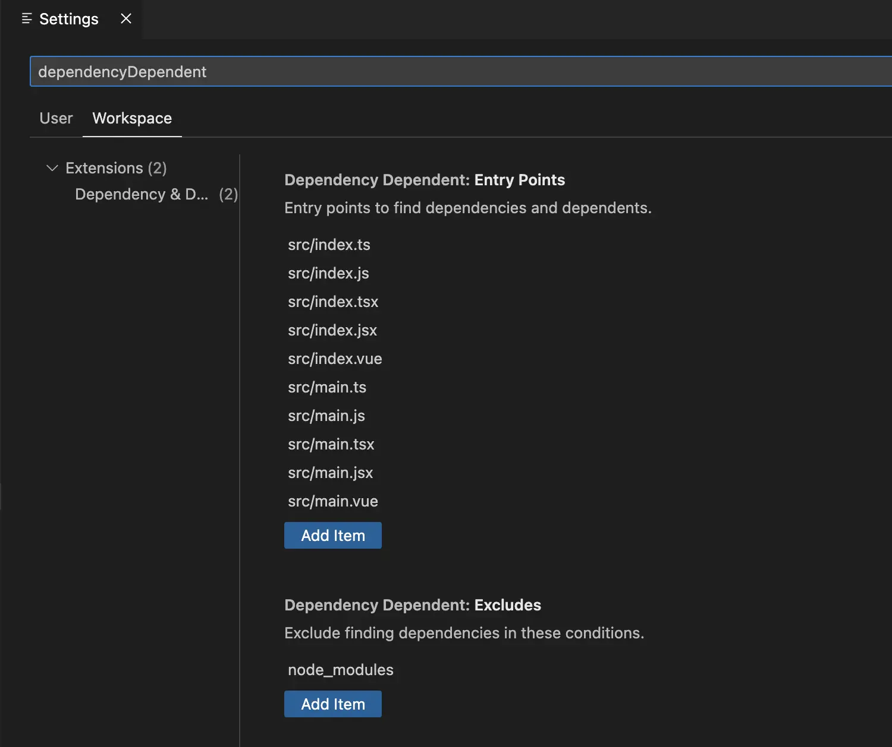

# 依赖和使用者

[English](./README.md) | 简体中文

查看依赖和使用者。



## 配置



### 入口文件

`dependencyDependent.entryPoints` 配置从哪些文件开始寻找依赖。默认是：

```json
[
  "src/index.ts",
  "src/index.js",
  "src/index.tsx",
  "src/index.jsx",
  "src/index.vue",
  "src/main.ts",
  "src/main.js",
  "src/main.tsx",
  "src/main.jsx",
  "src/main.vue"
]
```

如果你的项目的入口文件不在默认配置中，可以自行添加。

### 忽略文件

`dependencyDependent.excludes` 配置忽略寻找依赖的条件，默认是：

```json
["node_modules"]
```

如果需要忽略其他文件，可以自行添加。如果希望寻找 `node_modules` 的依赖可以删掉 `node_modules` 这个条件。

## 通过命令行安装

```bash
code --install-extension zjffun.dependency-dependent
```

## [更新日志](./CHANGELOG.md)

## [贡献](./CONTRIBUTING.md)
